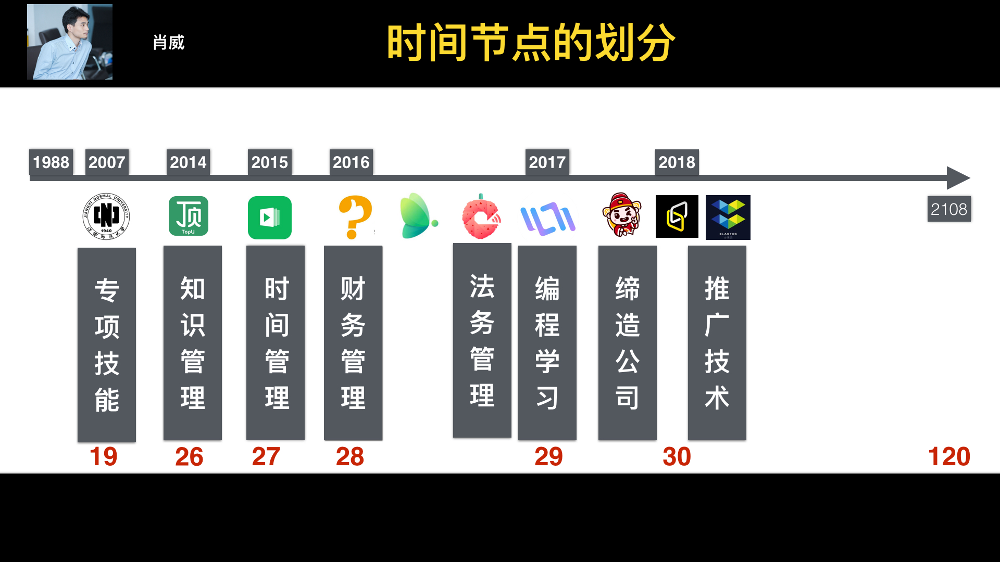
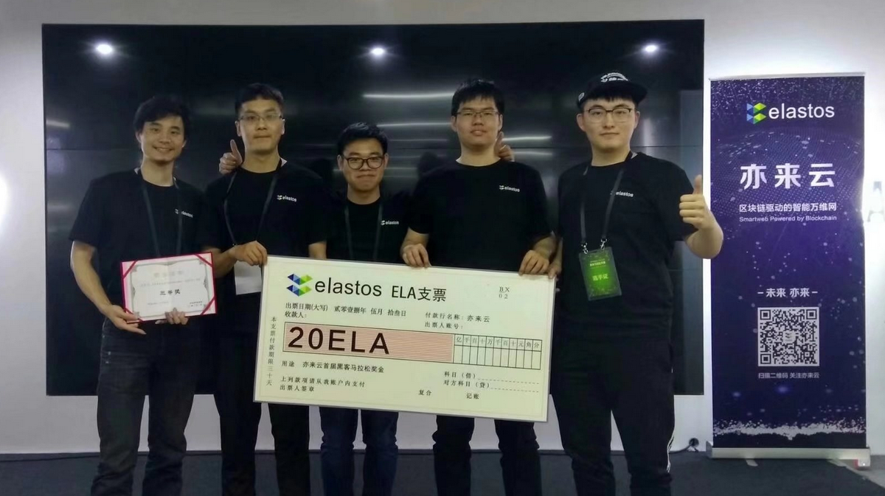

# 個人履歷 (Curriculum Vitae)

## 肖威（才华横溢创始人、董事长兼CEO）

1988年12月出生，湖北沙洋人，江西师范大学表演系学士。2014年加盟湖北省沙洋县神洲体育舞蹈学校，全面负责学校管理工作，2017年8月辞任神洲体育舞蹈学校副校长职务。2017年8月，创办才华横溢。

## 教育经历

1988年-2007年，在湖北省沙洋县实验高中学习；

2007年-2010年，在湖北省体育运动学校学习体育舞蹈专业学习；

2010年-2014年，在江西师范大学体育学院表演系学习，获得学士学位；

2015年-2016年，在湖北安平驾校学习，考取机动车驾驶证；

2016年-2017年，在湖北九州会计事务所从事会计事务的学习；

2016年-2017年，在新生大学软件学院全栈营学习 Ruby on Rails 网页端开发；

2017年-2017年，在湖北希文律师事务所从事法律事务的学习；

2017年-2017年，在蛋人网学习 React Native 移动端开发；

2017年-2018年，在孔壹学院区块链专业学习 BlockChain 区块链技术开发；

2017年-2018年，在微信程序开发大赛活动中学习 小程序 开发；

2018年-2018年，在清华大学区块链协会 学习 BlockChain 区块链技术 开发

2018年-2018年，在 Dapp University 学习 Dapp 的开发；

2018年-2018年，在 星云链 学习 Dapp 的开发；

2018年-2018年，在 TokenInsight 学习 区块链项目数据评估方法；

## 工作经历

2013-2014 在江西师范大学组织部负责党建工作；

2014-2017 在湖北省神洲体育舞蹈学校全面负责学校管理工作；

2014-2017 在顶你学堂、网易云课堂、跟谁学、荔枝微课 从事在线教师工作；

2017-2018 创办才华横溢; superxschool.com / SXB.one；超级学校/创始人；超级币/发行人；

2018-2018 在区块链研习社 担任 超级演说力 特邀讲师；

## 投资经历

才华横溢科技（北京）有限责任公司

# 社会荣誉

**Github：**

https://githubrank.com  400强 选手

**黑客马拉松：**

2017年10月22日 参加 上海 GoHack 黑客马拉松比赛，荣获优秀组织奖；

2018年05月13日 参加 北京 亦来云首届黑客马拉松比赛，荣获团体三等奖；

## 电子出版

《肖威的故事》：https://github.com/shenzhoudance/xiaoweiworkday

《撕裂式成长》：https://github.com/shenzhoudance/caihuathink

《积木式编程》：https://github.com/shenzhoudance/jimucoding

---

# 肖威个人简历

电话：+86 15701587150 邮件：494410617@qq.com


Github：https://github.com/shenzhoudance  Sina: https://weibo.com/busxiaowei

# 个人简介

- 才华横溢创办人兼首席执行官。创办：superxschool.com 。发行超级币：SXB.one

# 投资经历

才华横溢科技（北京）有限责任公司 股东（ 2017年8月 至 2018年3月 ）

# 工作经历

才华横溢科技（北京）有限责任公司 创办人兼首席执行官（ 2017年8月 至 2018年3月 ）

- 负责公司的团队管理，产品研发，行政事务，财务对接；

沙洋神洲舞蹈学校 副校长（ 2014年6月 至 2017年8月 ）

- 负责学校的教学事务，行政事务，财务事务，管理事务；

# 独立项目

Dribbble(包括：功能 + 查看 + 喜欢 + 评论 + 用户 + 图片)

- Github Repo: https://github.com/shenzhoudance/dribbble_clone

demo_blog (包含：功能 + 评论 + 设计)

- Github Repo: https://github.com/shenzhoudance/demo_blog

muse  (包含：功能 + 用户 + 设计 + 投票 + 部署)

- Github Repo: https://github.com/shenzhoudance/muse

# 所获奖项

- 2017年10月 荣获 Go Hack shanghai 比赛 优胜奖；

# 其他技能

- 网页端开发 Ruby on Rails & HTML & CSS & JavaScript

- 移动端开发 React Native & Android & iOS & Mini

- 微信端开发 JavaScript

- 区块链开发 Solidity & Web3.js & Truffle & Hyperledger Fabric & IPFS

# 教育经历

- 清华大学区块链 （技能培训）2018年04月 至 2018年06月

- 微信程序开发大赛（技能培训）2018年03月 至 2018年05月

- 孔壹学院职业学院（技能培训）2017年10月 至 2017年12月

- 新生大学软件学院（技能培训）2017年01月 至 2017年12月

- 江西师范大学本科（体育表演）2010年06月 至 2014年06月

# 人生感悟

加强学习，提升技能，强化管理，打造产品，做好销售，

是在当今互联网时代优化自我简历价值，提升自我交换价值的唯一途径。
---

----

介绍一下你自己和所做的工作。

肖威, 在线教育公司 才华横溢 创始人兼 CEO 。本科毕业于江西师范大学，2017 年新生大学软件学院毕业后北上，2018 年创立了面向普通人提供 在线职业技能 服务的公司——才华横溢。

才华横溢 在做的是一件很酷的事情：最低只需1元钱，就能获得你想要获得的职业技能服务。

---

## **肖威简历**

肖威，男，1988 年生，湖北沙洋人。自媒体作者，天使投资人。

- 被动收入：股份，才华横溢科技（北京）有限责任公司 创始人兼 CEO；
- 主动收入：服务，超级学校 产品（xxxxschool.com）；
- 被动收入：作品，自出版书籍 思想 「撕裂式成长」/ 技能 「积木化编程」；

增加被动收入大于主动收入满足自己的生活必须，就可以完成个人的时间的解放，从而让自己的时间成为产生自己资产的有力武器，从而实现真正的时间自由和财务自由。

**2010-2014 求学：**

江西师范大学体育学院表演系学习，在校期间曾担任班级班长、团支部书记、第七届党员服务站站长等职务，在校期间曾荣获国家奖学金、特等专业奖学金、优秀共青团干部等称号，曾荣获江西省学生体育舞蹈十项全能冠军。曾代表江西师范大学赴澳大利亚悉尼大学、香港中文大学访学交流，访学期间曾荣获 「先进个人」 称号。

**2014-2017 就业：**

江西师范大学体育学院表演系毕业后，加入湖北省神洲舞蹈学校担任副校长，在此期间从事在线教育的学习和实践，在顶你学堂、网易云课堂、跟谁学、荔枝微课上开设职业技能体系课程。在职期间曾担任全国体育舞蹈比赛副计分长、湖北省体育舞蹈公开赛竞赛长、荆门市体育舞蹈锦标赛检录长等职务，曾荣获 「优秀共产党员」 称号。

**2017-2018 创业：**

学习李笑来主办的新生大学全栈营之后北上，创办才华横溢职业技能编程培训公司，提供有价值的编程技能培训服务，在此期间不断的打造互联网产品，最终依靠互联网的产品自动化运营完成公司的正常化运转。创业期间曾荣获 「最美在外家乡人」 称号。

**2018-2120 投资：**

当公司逐渐走向常规化之后，开始全球的投资活动和教育活动，帮助有理想有抱负的孩子通过成立公司改变世界。

# 現職 (Current position)
才华横溢科技（北京）有限责任公司 董事长

帮助普通人通过在线职业技能学习改变自己的命运

跟随那些有结果的人学习，才能快速帮助自己获取成功

Chairman，Brilliant science and Technology (Beijing) Company with limited liability

# 風采展示（Demo display）

WHY:为什么 做 才华横溢 ？

HOW:才华横溢 应该 如何做 ？

WHAT:才华横溢 要做 什么 ？

http://www.iqiyi.com/w_19rwm5cz3p.html

# 最新思想作品（The NetWork）

❶ 《肖威领导力·音频课程》肖威著  (2018.01.01-2018.12.31)

http://www.ximalaya.com/20626154/album/12371050/

❷ 《职场生存指南》肖威著  (2018.01.01-2018.12.31)

https://shenzhoudance1.gitbooks.io/caihuathink/content/

# 網絡作品（The NetWork）

❶ 《懂你时间：在线教育网站开发》肖威著  (2018.01.28-2018.02.01)

https://caihuahengyicss.herokuapp.com/

❷ 《留言管理：在线留言面板》肖威著  (2018.02.03-2018.02.03)

https://caihuamessageapp.herokuapp.com/

❸

# 個人思想作品 (Personal Works) ❶❷❷❸❹❺❻❼❽❾❿

❶ 《卓越法门》 肖威著  (2014.05.08-2015.08.08)

https://shenzhoudance1.gitbooks.io/zhuoyuefamen/content/

❷ 《缔造人生》 肖威著  (2015.08.08-2016.01.18)

https://shenzhoudance1.gitbooks.io/dizaorensheng/content/

❸ 《改变命运的88堂思想课》 肖威著 (2016.01.18-2016.05.18)

https://shenzhoudance1.gitbooks.io/sixiangke/content/

❹ 《世界纵横》肖威著  (2016.05.18-2016.09.18)

https://shenzhoudance1.gitbooks.io/shijiezongheng/content/

❺ 《知识赋能》肖威著  (2017.02.18-2017.04.18)

https://shenzhoudance1.gitbooks.io/zhishifuneng/content/

❻ 《增量思维》肖威著  (2017.04.18-2017.07.18)

https://shenzhoudance1.gitbooks.io/zengliangsiwei/content/

❼ 《逆袭：解放时间的快刀》肖威著  (2017.08.18-2017.12.28)

https://shenzhoudance1.gitbooks.io/kuaidaonixi/content/

❽ 《创业圣经：打造才华横溢的秘籍》肖威著  (2017.08.28-2018.08.28)

https://shenzhoudance1.gitbooks.io/xiaoweiwork/content/

❾ 《撕裂式成长》肖威著  (2018.01.01-2018.12.31)

https://shenzhoudance1.gitbooks.io/caihuathink/content/

# 技能特訓（Skill training）

❶ 全栈工程师

在编程技能的体系里面，会基于现在我们已经完成的网页端、移动端、微信端的产品，教授学生如何快速的掌握互联网产品的编程体系，完成网页端的产品打造，完成移动端的产品的打造，完成微信端的产品的打造，从而帮助学生可以快速的立足互联网科技公司，具备核心的竞争能力；

❷ 新媒体运营

在内容营销的体系里面，会基于我现在已经完成文字营销、图片营销、视频营销、音频营销、事件营销、活动运营的方式，教授我们的孩子最前沿的产品营销的手段，最大化的学习如何才可以完成自己产品的曝光，从而帮助产品完成流量的获取，从而完成产品的复购化的交易；

❸ 超级领导力

在企业投资的体系里面，会请资深人士完成财务技能的教学，在教学的进行中，使用真实的公司开展教学，系统的学习如何完成财务报表的生成，国税局的税务申报，普票和专票的发票开具，通过这个过程中，从财务的角度理解公司，更好的帮助自己后期通过阅读财务报表完成对于早期公司和上市公司的投资；

❹ 学费：16800元/年，首期全国招募20人，学制1年；

针对于学生所学习的能力可以完成公司的留任和企业的推荐，帮助学生完成互联网可以公司的就业、互联网科技公司的创业、互联网公司的投资；

# 會員招募 （Membership recruitment）

❶ 全年招募千一会员;

每期1000人，每期1888元/年，享受人才研习社的普通会员服务。

❷ 全年招募万一会员;

每期100人，每期1万元/年，提升自己能力的同时，
可有机会参加才华横溢科技（北京）有限责任公司的投资活动，获取个人成长的同时，获取资本增值的机会。

❸ 服务时间：

2018.1.1开始-2018.12.31截止；

# 聯絡方式 (Contact with me as followings)

❶ FB粉絲團：Facebook：

https://www.facebook.com/wei.xiao.39395

❷ 微信公众账号：肖威洞察

xiaoweidongcha

❸ 今日头条账号：肖威

https://www.toutiao.com/c/user/6830006463/#mid=6829607654

❹ 喜马拉雅账号：肖威大型人才研习社

http://www.ximalaya.com/20626154/album/12371050/

❺ 知乎联络账号：肖威

https://www.zhihu.com/people/xiaoweidongcha/activities

❻ 微信个人账号：肖威

---

# 學歷 (Education)

谷歌大学  计算机科学与人工智能 博士

Computer Science and Artificial Intelligence Ph.D，Google University

江西师范大学 文学学士

Bachelor of Arts，Jiangxi Normal University

# 經歷 (Career) 求學 就業 創業 投資

### ❶ 投資

2018-2020 北京共创者网络科技有限公司

### ❷ 創業

2017-2018 才华横溢科技（北京）有限责任公司 创始人兼CEO

### ❸ 就業

2014-2017 顶你学堂/网易云课堂/跟谁学/千聊/荔枝/葱课 课程讲师

2014-2017 湖北省神洲舞蹈学校 副校长

2013-2014 南昌健易美 课程教师

2012-2013 南昌舞之韵 课程教师

2011-2012 南昌勇卓舞蹈学苑 课程教师

### ❹ 求學

2010-2014 江西师范大学 党员服务站 站长 + 悉尼大学/香港中文大学 访学交流

2007-2010 湖北省体育舞蹈学校 团支部 书记

2004-2007 湖北省沙洋高中 生活委员

2001-2004 湖北省实验初中 生活委员

1988-2001 湖北省实验小学 生活委员

## 學習 (STUDY)

专案开发。我总结分为五步走，其中包括：

❶ 功能开发（我们需要达成什么样的目标）

❷ 用户体系（我们如何完成一对一，一对多的用户关系的对应）

❸ 云端部署（我们如何完成真实环境下的项目部署）

❹ 页面美化（我们如何更好的完成页面的优化）

❺ 支付逻辑（我们如何完成产品的支付逻辑的实现）

---

2018.04.28 在 HiBlock 区块链社区学习 线下课程 3步开发以太坊 Dapp

2018.04.16 在清华大学区块链协会学习 区块链理论知识体系；

2018.04.15 BarbieTechFabulous 网路教学 Ruby on Rails 1个案例练习

2018.04.10 Andy Leverenz 网路教学 Ruby on Rails 5个案例练习；

2018.03.15 Mackenzie Child 网络教学 Ruby on Rails 12个案例练习；

2018.03.03 五倍紅寶石 为你自己学 Ruby on Rails 在线书籍；

2018.03.02 代码家 区块链与数字资产 内部分享；

2018.02.12 硅谷live 智能合约开发课 在线 学习 智能合约逻辑体系；

2018.02.11 小专栏 区块链技术 在线 学习 区块链项目逻辑；

2018.02.01 清华大学icenter区块链技术开发公开课 在线 学习 区块链底层知识结构；

2018.01.31 实验楼 Ruby on Rails 在线 学习 基础知识的优化；

2018.01.30 宁浩网 Ruby on Rails 在线 学习 微信在线支付的逻辑结构；

2018.01.29 麦子学院 Ruby on Rails 在线 学习 云端部署和编辑器的使用；

2018.01.14 丽亭华苑 微信智能机器人 线下 学习 微信智能机器人的使用；

2017.12.28 蛋人网 Ruby on Rails，React-Native，微信公众账号开发，在线 学习 三端运作逻辑；

2017.10.21 心动网络 Go-Beego 线下 学习 Go语言运行逻辑；

2017.10.16 孔壹学院 block-chain 线下 学习 区块链项目开发；

2017.01.21 新生大学 学习 论坛网站、招聘网站、电商网站 Ruby on Rails 3个案例练习；

## 舉辦 (HOLD)

产品运营，我总结为线上分为线上和线下两个部分：

❶ 线上内容营销；
通过图片、视频、音频、文字的形式完成 100000+ 的品牌的推广；

❷ 线下活动推广：
通过举办免费和付费的活动，完成品牌的形象传播和用户的口碑营销；

---

2017.12.31 北京海淀 举办 才华横溢产品发布会

2017.10.26 北京海淀 举办 Ruby & Go技术分享会

## 參與 (PARTY)

2018.03.31 北京海淀 学习 微信小程序 敏捷开发实战

2018.02.02 北京朝阳 参与 墨刀茶话会

2018.01.24 北京朝阳 参与 微软加速器 第10期 Demo Day活动

2018.01.21 北京昌平 参与 AR学院首次线下交流活动

2018.01.14 北京海淀 参与 女生科技体验节

2017.12.23 北京海淀 参与 NEO技术生态大会

2017.12.10 北京海淀 参与 星云链分享会

2017.12.03 北京海淀 参与 区块链万里行

2017.10.25 北京朝阳 参与 从大数据到区块链 高端分享会

2017.10.20 上海浦东 参与 区块链投资闭门论坛

2017.09.09 北京海淀 参与 多媒体开发技术大会

2017.09.02 北京海淀 参与 玛娜花园 路演

# 證照 (CERTIFICATION)

国家一级教师

国家一级裁判

Teachers at the national level

International first level referee

# 教学專長 (Skills/expertise)

Ruby on rails；React-Nation；Go-Beego；blockchain;

# 商業計劃書投遞 (Business Plan Delivery)

494410617@qq.com
