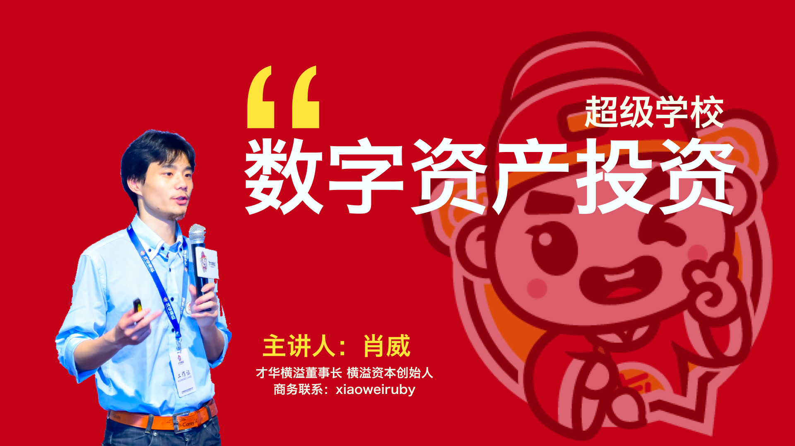

# 個人履歷 (Curriculum Vitae)

肖威, Wei-Xiao

# 現職 (Current position)
才华横溢科技（北京）有限责任公司 董事长

帮助普通人通过在线职业技能学习改变自己的命运

跟随那些有结果的人学习，才能快速帮助自己获取成功

Chairman，Brilliant science and Technology (Beijing) Company with limited liability

# 風采展示（Demo display）

WHY:为什么 做 才华横溢 ？

HOW:才华横溢 应该 如何做 ？

WHAT:才华横溢 要做 什么 ？

http://www.iqiyi.com/w_19rwm5cz3p.html

# 個人作品 (Personal Works)

❶ 《卓越法门》 肖威著  (2014.05.08-2015.08.08)

https://shenzhoudance1.gitbooks.io/zhuoyuefamen/content/

❷ 《缔造人生》 肖威著  (2015.08.08-2016.01.18)

https://shenzhoudance1.gitbooks.io/dizaorensheng/content/

❸ 《改变命运的88堂思想课》 肖威著 (2016.01.18-2016.05.18)

https://shenzhoudance1.gitbooks.io/sixiangke/content/

❹ 《世界纵横》肖威著  (2016.05.18-2016.09.18)

https://shenzhoudance1.gitbooks.io/shijiezongheng/content/

❺ 《知识赋能》肖威著  (2017.02.18-2017.04.18)

https://shenzhoudance1.gitbooks.io/zhishifuneng/content/

❻ 《增量思维》肖威著  (2017.04.18-2017.07.18)

https://shenzhoudance1.gitbooks.io/zengliangsiwei/content/

❼ 《逆袭：解放时间的快刀》肖威著  (2017.08.18-2017.12.28)

https://shenzhoudance1.gitbooks.io/kuaidaonixi/content/

❽ 《创业圣经：打造才华横溢的秘籍》肖威著  (2017.08.28-2018.08.28)

https://shenzhoudance1.gitbooks.io/xiaoweiwork/content/

❾ 《肖威领导力·音频课程》肖威著  (2018.01.01-2018.12.31)

http://www.ximalaya.com/20626154/album/12371050/

❿ 《懂你时间：在线教育网站开发》肖威著  (2018.01.28-2018.03.06)

https://caihuahengyicss.herokuapp.com/

# 技能特訓（Skill training）

❶ 全栈工程师

在编程技能的体系里面，会基于现在我们已经完成的网页端、移动端、微信端的产品，教授学生如何快速的掌握互联网产品的编程体系，完成网页端的产品打造，完成移动端的产品的打造，完成微信端的产品的打造，从而帮助学生可以快速的立足互联网科技公司，具备核心的竞争能力；

❷ 新媒体运营

在内容营销的体系里面，会基于我现在已经完成文字营销、图片营销、视频营销、音频营销、事件营销、活动运营的方式，教授我们的孩子最前沿的产品营销的手段，最大化的学习如何才可以完成自己产品的曝光，从而帮助产品完成流量的获取，从而完成产品的复购化的交易；

❸ 超级领导力

在企业投资的体系里面，会请资深人士完成财务技能的教学，在教学的进行中，使用真实的公司开展教学，系统的学习如何完成财务报表的生成，国税局的税务申报，普票和专票的发票开具，通过这个过程中，从财务的角度理解公司，更好的帮助自己后期通过阅读财务报表完成对于早期公司和上市公司的投资；

❹ 学费：16800元/年，首期全国招募20人，学制1年；

针对于学生所学习的能力可以完成公司的留任和企业的推荐，帮助学生完成互联网可以公司的就业、互联网科技公司的创业、互联网公司的投资；

# 會員招募 （Membership recruitment）

❶ 全年招募千一会员;

每期1000人，每期1888元/年，享受人才研习社的普通会员服务。

❷ 全年招募万一会员;

每期100人，每期1万元/年，提升自己能力的同时，
可有机会参加才华横溢科技（北京）有限责任公司的投资活动，获取个人成长的同时，获取资本增值的机会。

❸ 服务时间：

2018.1.1开始-2018.12.31截止；

# 聯絡方式 (Contact with me as followings)

❶ FB粉絲團：Facebook：

https://www.facebook.com/wei.xiao.39395

❷ 微信公众账号：肖威洞察

xiaoweidongcha

❸ 今日头条账号：肖威

https://www.toutiao.com/c/user/6830006463/#mid=6829607654

❹ 喜马拉雅账号：肖威大型人才研习社

http://www.ximalaya.com/20626154/album/12371050/

❺ 知乎联络账号：肖威

https://www.zhihu.com/people/xiaoweidongcha/activities

❻ 微信个人账号：肖威

---

# 學歷 (Education)
江西师范大学表演系

Department of performance，Jiangxi Normal University

# 經歷 (Career)
2017-2018 才华横溢科技（北京）有限责任公司 董事长

2014-2017 湖北省神洲舞蹈学校 副校长

2010-2014 江西师范大学 党员服务站 站长

2007-2010 湖北省体育舞蹈学校 团支部 书记

2004-2007 湖北省沙洋高中 生活委员

2001-2004 湖北省实验初中 生活委员

1998-2001 湖北省实验小学 生活委员

## 學習 (STUDY)

专案开发。我总结分为五步走，其中包括：

❶ 功能开发（我们需要达成什么样的目标）

❷ 用户体系（我们如何完成一对一，一对多的用户关系的对应）

❸ 云端部署（我们如何完成真实环境下的项目部署）

❹ 页面美化（我们如何更好的完成页面的优化）

❺ 支付逻辑（我们如何完成产品的支付逻辑的实现）

---

2018.01.30 宁浩网 Ruby on Rails 在线 学习；

2018.01.29 麦子学院 Ruby on Rails 在线 学习；

2018.01.14 丽亭华苑 微信智能机器人 线下 学习；

2017.12.28 蛋人网 Ruby on Rails，React-Native，微信公众账号开发，在线 学习；

2017.10.21 心动网络 Go-Beego 线下 学习；

2017.10.16 孔壹学院 block-chain 线下 学习；

2017.01.21 新生大学 Ruby on Rails 在线 学习；

## 舉辦 (HOLD)

产品运营，我总结为线上分为线上和线下两个部分：

❶ 线上内容营销；
通过图片、视频、音频、文字的形式完成 100000+ 的品牌的推广；

❷ 线下活动推广：
通过举办免费和付费的活动，完成品牌的形象传播和用户的口碑营销；

---

2017.12.31 北京海淀 举办 才华横溢产品发布会

2017.10.26 北京海淀 举办 Ruby & Go技术分享会

## 參與 (PARTY)

2018.01.24 北京朝阳 参与 微软加速器 第10期 Demo Day活动

2018.01.21 北京昌平 参与 AR学院首次线下交流活动

2018.01.14 北京海淀 参与 女生科技体验节

2017.12.23 北京海淀 参与 NEO技术生态大会

2017.12.10 北京海淀 参与 星云链分享会

2017.12.03 北京海淀 参与 区块链万里行

2017.10.25 北京朝阳 参与 从大数据到区块链 高端分享会

2017.10.20 上海浦东 参与 区块链投资闭门论坛

2017.09.09 北京海淀 参与 多媒体开发技术大会

2017.09.02 北京海淀 参与 玛娜花园 路演

# 證照 (CERTIFICATION)

国家一级教师

国家一级裁判

Teachers at the national level

International first level referee

# 教学專長 (Skills/expertise)

Ruby on rails；React-Nation；Go-Beego；blockchain;

# 商業計劃書投遞 (Business Plan Delivery)

494410617@qq.com
